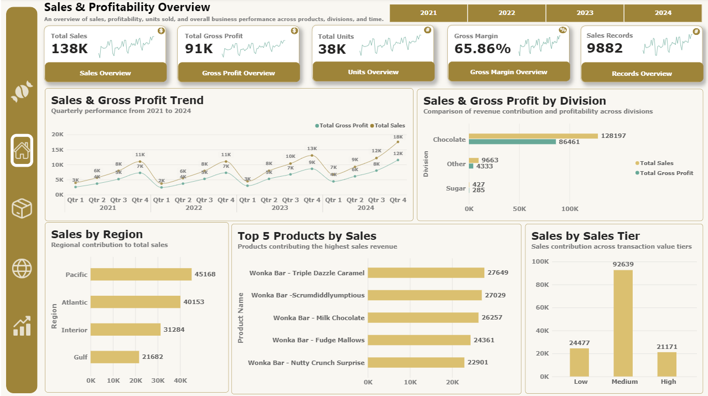
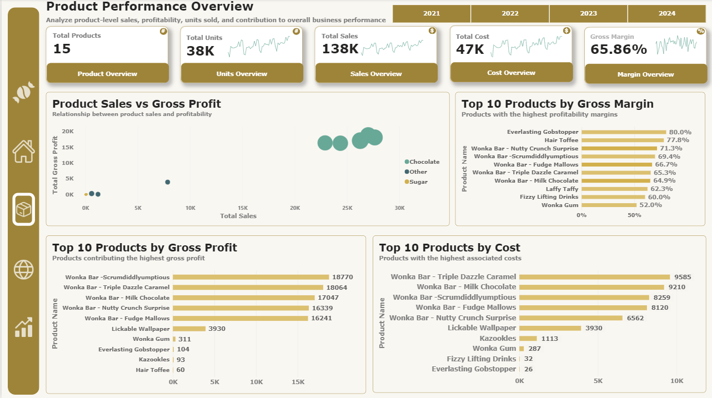
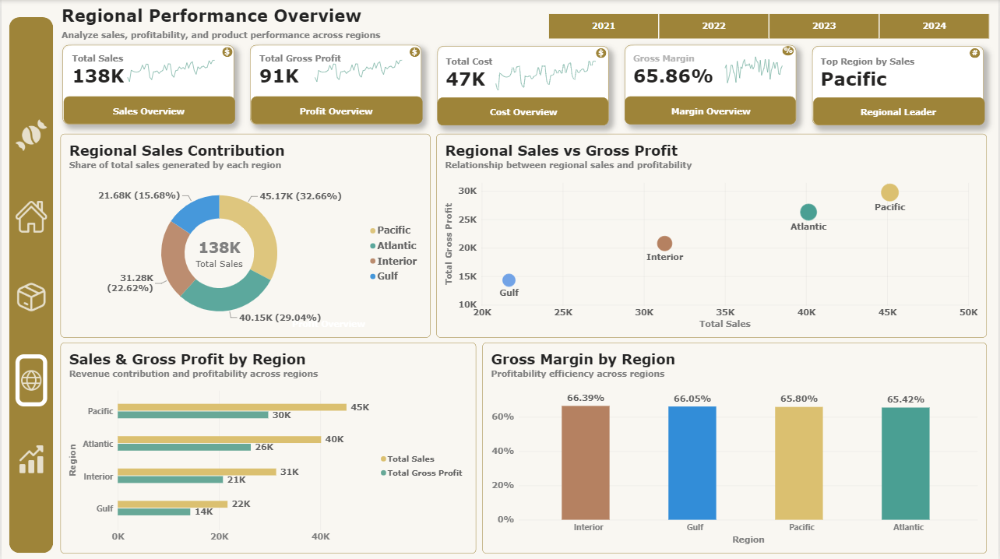
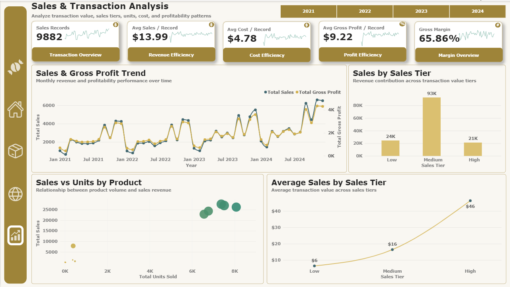

# Confectionery Sales & Profitability Analytics

## 📊 Project Overview

Excel and Power BI analytics project analyzing sales, costs, profitability, product performance, regional performance, and transaction trends for a US candy distributor.

## 🎯 Business Objectives

- Analyze overall sales and profitability
- Identify high-performing products
- Compare regional performance
- Analyze transaction patterns
- Evaluate cost and gross margin

## 🛠️ Tools & Technologies

- Microsoft Excel — Data cleaning, transformation, analysis, and calculations
- Microsoft Power BI — Dashboard development, visualization, and interactive reporting

## 📑 Dashboard Pages

### 1. Executive Overview
Overall business performance across sales, cost, profit, units, and time.

### 2. Product Performance
Product-level analysis of sales, cost, gross profit, and gross margin.

### 3. Regional Performance
Comparison of sales, profitability, and contribution across regions.

### 4. Sales & Transaction Analysis
Analysis of transaction value, sales tiers, cost, profitability, and trends.

## 🖼️ Dashboard Preview

### Executive Overview

### Product Performance

### Regional Performance

### Sales & Transaction Analysis

## 📈 Key Metrics

| Metric | Value |
|---|---:|
| Sales Records | 9,882 |
| Total Sales | $138,287.61 |
| Total Cost | $47,208.71 |
| Gross Profit | $91,078.90 |
| Gross Margin | 65.86% |
| Total Units Sold | 37,668 |

## 📂 Repository Structure

- `Data/` — Dataset files
- `Excel/` — Excel analysis and supporting files
- `Power BI/` — Power BI dashboard
- `SVG/` — Dashboard design assets
- `Screenshots/` — Dashboard previews
- `Documentation/` — Project documentation

## 📚 Documentation

Detailed documentation covering:

- Data Cleaning
- Data Dictionary
- Business Insights
- DAX Measures

## 🚀 Project Outcome

Built an interactive four-page Power BI dashboard using Excel-prepared data to analyze sales, costs, profitability, products, regions, and transaction trends.